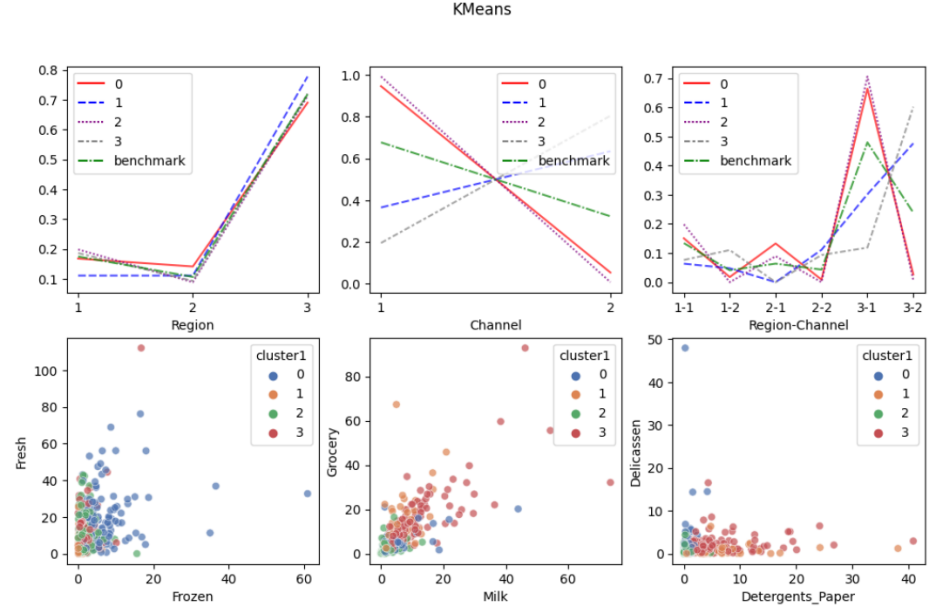
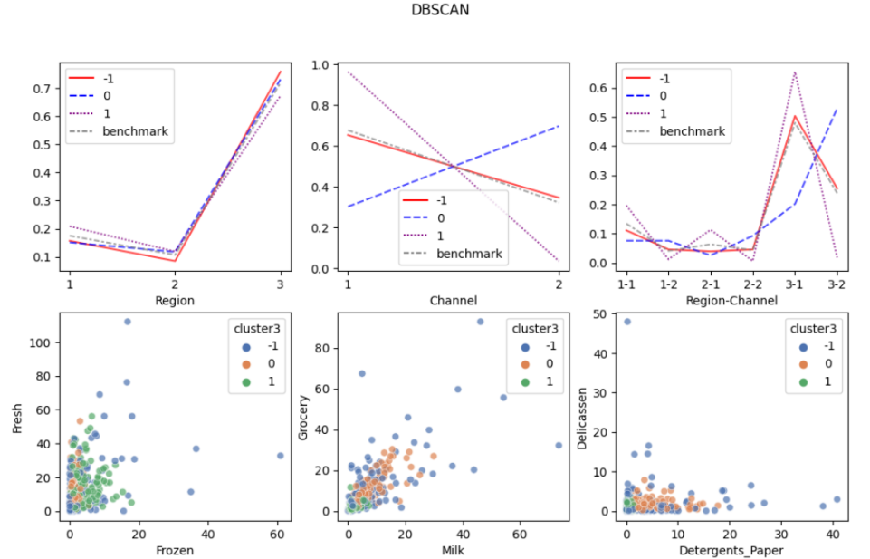

<h2>Purpose</h2>

Segment the Wholesale customers in groups with similar expenses patterns.

<h2>Methodology</h2>

Refer to: **Methodology.pdf**

Experiment with 3 methods: KMeans Clustering, Hierarchical Clustering, and DBSCAN.

<h2>Challenge</h2>

* Find the optimal number of clusters and compare results between algorithms.

<h2>Result</h2>

